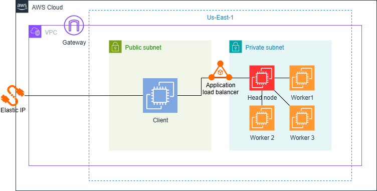

# Comparación de Infraestructuras Paralelas y Distribuidas en ML con Ray

## Intención del Proyecto
Este proyecto compara el rendimiento y eficiencia de infraestructuras de cómputo paralelas y distribuidas en problemas de machine learning, especialmente en la optimización de hiperparámetros de modelos. Se utiliza Ray para implementar búsquedas de hiperparámetros secuenciales y paralelas/distribuidas, analizando ventajas y desventajas de cada enfoque.

## Estructura del Proyecto

```
├── Api/
│   ├── app.py                # API principal (Flask)
│   ├── SequencialSearch.py   # Búsqueda secuencial de hiperparámetros
│   ├── requirements.txt      # Dependencias de la API
│   ├── Dockerfile            # Dockerización de la API
│   ├── Dockerfile.worker     # Dockerfile para worker Ray
│   ├── Ray/
│   │   ├── ConnectRay.py         # Conexión y gestión de Ray
│   │   └── ParalelDisSearch.py  # Búsqueda paralela/distribuida
│   └── utils/
│       ├── distributed_test.py   # Pruebas de distribución
│       └── peticion.py           # Ejemplo de petición a la API
├── Client/
│   ├── src/
│   │   ├── App.jsx               # Componente principal React
│   │   ├── main.jsx              # Entrada de la app
│   │   ├── index.css             # Estilos principales
│   │   ├── components/
│   │   │   └── ...               # Componentes de UI
│   │   └── api/                  # Lógica de comunicación con backend
│   ├── package.json              # Dependencias frontend
│   ├── vite.config.ts            # Configuración Vite
│   └── Dockerfile                # Dockerización del frontend
├── Scripts/
│   ├── ainit.bash                # Inicialización del nodo principal
│   ├── cinit.bash                # Inicialización del cliente
│   └── winit.bash                # Inicialización de workers
├── AwsArch.png                   # Diagrama de arquitectura AWS
├── AwsDeployment.md              # Guía de despliegue AWS
├── .gitignore
└── README.md
```

## Instrucciones de Uso

### Backend (API)

1. **Instalación Local:**
   ```bash
   cd Api
   pip install -r requirements.txt
   pip install ray  # Instalación separada para compatibilidad
   ```

2. **Iniciar la API:**
   ```bash
   python app.py
   ```

### Frontend (Cliente React)

1. **Instalación:**
   ```bash
   cd Client
   npm install
   ```

2. **Iniciar aplicación en modo desarrollo:**
   ```bash
   npm run dev
   ```

## API Endpoints

### POST /sequential-search
Realiza búsqueda secuencial de hiperparámetros y predicción.

### POST /parallel-search
Realiza búsqueda paralela de hiperparámetros usando Ray.

**Ejemplo de payload para ambos endpoints:**
```json
{
  "param_grid": {
    "hidden_layer_sizes": [[5], [10]],
    "activation": ["relu"],
    "solver": ["adam"],
    "alpha": [0.001],
    "max_iter": [50]
  },
  "age": 25,
  "gender": 1,
  "education": 3,
  "country": 2,
  "ethnicity": 1,
  "nscore": 0.5,
  "escore": 0.3,
  "oscore": 0.2,
  "ascore": 0.1,
  "cscore": 0.4,
  "impulsive": 0.6,
  "ss": 0.7
}
```

**Ejemplo de respuesta:**
```json
{
  "best_params": { ... },
  "best_score": 0.85,
  "search_time": 12.34,
  "prediction": 1
}
```

## Despliegue
Para levantar todo el stack de desarrollo:

### Front(from docker hub)
la api siempre apunta al LB para desarollo local cambiar el archivo 
Client/src/api/axiosConfig.js, depues de iniciar el contenedor
```bash
docker run -d -p 8080:80 bayronj/rayclientvf:latest
```

### API(from docker hub)
ejecucion de la api desde docker hub
```bash
docker run -d --name ray_head -p 6379:6379 -p 8265:8265 -p 10001:10001 -p 5000:5000 bayronj/rayapi:latest

```

### worker(from docker hub)
Para ejecutar el worker, usar el ip del head(API)
```bash
docker run -d -it --name ray_worker bayronj/raywork:latest
docker exec -it ray-worker bash -c "ray start --address=<ip_head>:6379 && tail -f /dev/null"

```

### AWS



Para más detalles, consulta `AwsDeployment.md`.

Para instrucciones detalladas sobre el despliegue en AWS, consulta el archivo `AwsDeployment.md`.

## Scripts de Despliegue

El directorio `Scripts/` contiene los scripts necesarios para configurar un cluster distribuido:

- `headinit.bash`: Configura el nodo principal
- `rayinit.sh`: Inicializa Ray
- `workerinit.bash`: Configura los nodos worker

Para más detalles sobre la configuración distribuida, consulta `AwsDeployment.md`.


